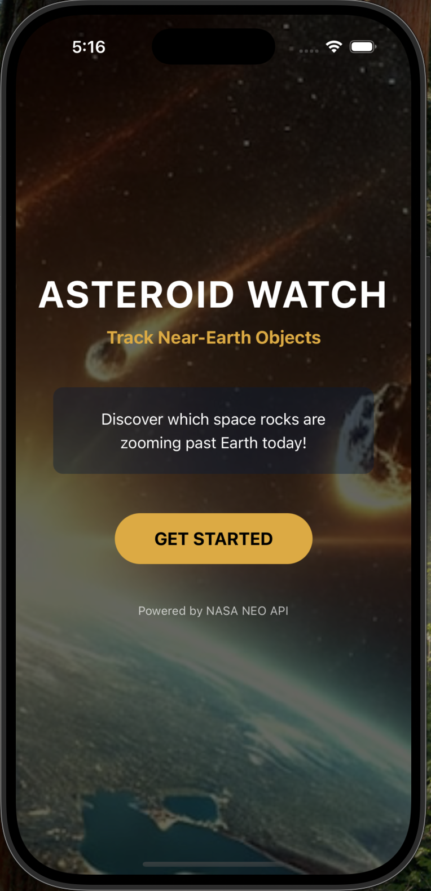
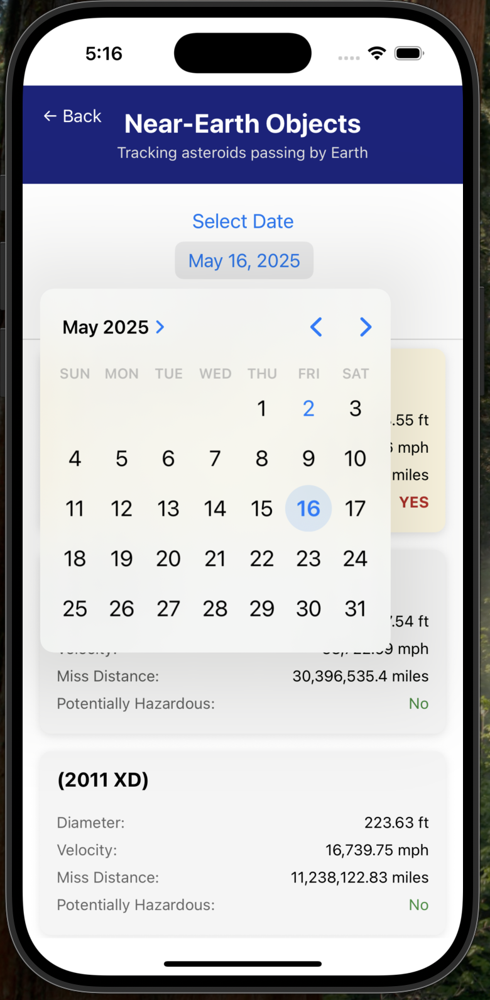
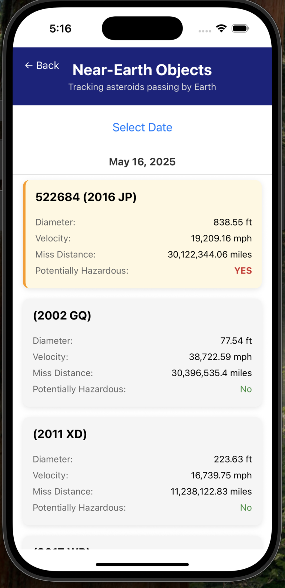
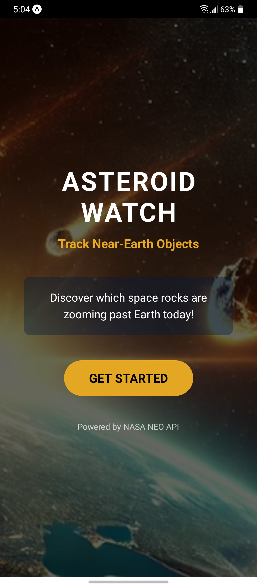
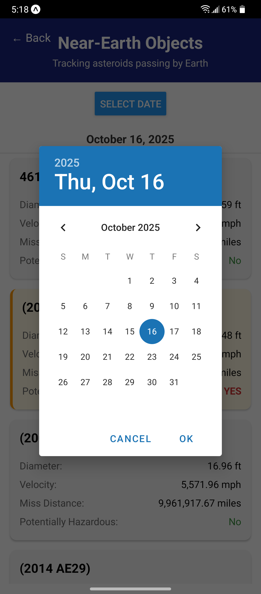
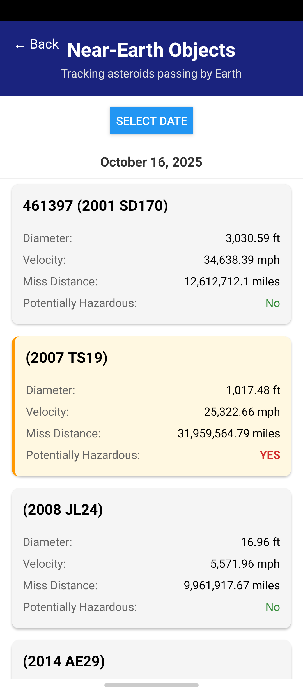

# ASTEROID WATCH

A React Native mobile application that displays Near-Earth Objects (asteroids) passing by Earth on a selected date using NASA's NEO API.

## Features

* View near-Earth objects for the current date by default
* Select any date to view asteroids passing by Earth on that day
* View detailed information about each NEO:
   * Name
   * Approximate diameter in feet
   * Relative velocity in miles per hour
   * Miss distance in miles
   * Whether it's potentially hazardous

## Screenshots
### iOS
 




### Android




## Installation and Setup

### Prerequisites
* Node.js
* npm or yarn
* Expo CLI
* Expo Go app on your mobile device or iOS/Android emulator

### Steps to Run the Application

1. Clone this repository:

```bash
git clone https://github.com/sofjaved/red-foundry-neo-challenge
cd near-earth-objects
```

2. Install dependencies:

```bash
npm install
# or
yarn install
```

3. Start the development server:

```bash
npx expo start
# or
npm start
```

4. Run the application:
   * Scan the QR code with the Expo Go app (Android) or the Camera app (iOS)
   * Press 'a' to open on Android emulator
   * Press 'i' to open on iOS simulator

## Technical Details
* Built with React Native using Expo
* Uses NASA's NEO API to fetch asteroid data
* Implements date selection to view NEOs for specific dates
* Displays detailed information about each asteroid
* Features a responsive UI design

## API Information
This application uses NASA's NEO Web Service API:
* Base URL: https://api.nasa.gov/neo/rest/v1
* Documentation: https://api.nasa.gov/

## Project Structure

```
red-foundry-neo-challenge/
├── src/
│   ├── api/          # API connection logic
│   ├── components/   # Reusable UI components
│   ├── screens/      # Application screens
│   └── utils/        # Helper functions
├── App.js            # Main application component
└── package.json      # Project dependencies
```

## Future Enhancements
* Implement a date range selection
* Add sorting options for the NEO list
* Create a detailed view for each asteroid
* Add unit tests 
* Implement filtering capabilities
